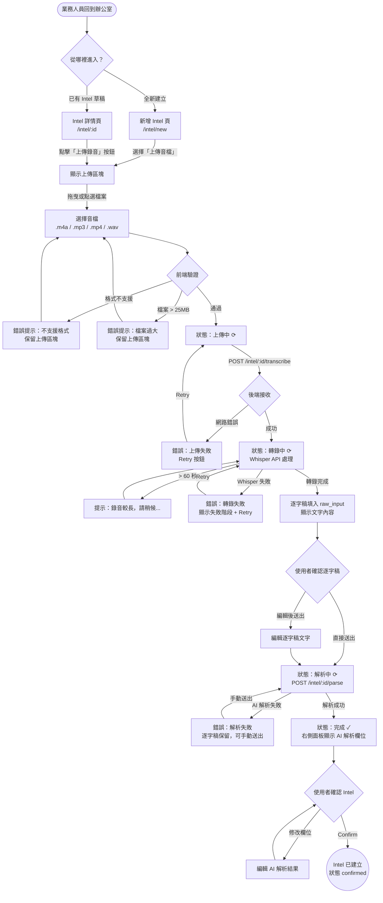

# User Flow: Audio Transcription → Intel

**Feature:** `audio-transcription`
**Date:** 2026-03-31
**Related Requirement:** `docs/requirements/audio-transcription.md`

---

## Entry Points

| Entry | Where | Trigger |
|-------|-------|---------|
| A | Intel 詳情頁（已存在的 Intel） | 點擊「上傳錄音」按鈕 |
| B | 新增 Intel 頁 | 選擇「上傳音檔」建立方式 |

---

## Happy Path Flow

---

## Error Branch Summary

| 錯誤情境 | 發生階段 | 處理方式 |
|----------|----------|----------|
| 格式不支援 | 前端驗證 | 紅色提示，重新選檔 |
| 檔案 > 25MB | 前端驗證 | 紅色提示，重新選檔 |
| 網路上傳失敗 | 上傳中 | 顯示 Retry 按鈕 |
| Whisper API 失敗 | 轉錄中 | 顯示失敗階段 + Retry |
| AI Parse 失敗 | 解析中 | 逐字稿保留，可手動觸發解析 |

---

## Screen Inventory

| # | Screen | Purpose | Key Elements |
|---|--------|---------|-------------|
| S1 | Intel 詳情頁（含上傳區塊） | 主要入口，對已有草稿的 Intel 上傳錄音 | 上傳按鈕、狀態列、逐字稿文字框、AI 解析面板 |
| S2 | 新增 Intel 頁（音檔模式） | 全新建立，選擇音檔作為輸入來源 | 輸入方式切換、拖曳上傳區、狀態列 |
| S3 | 上傳進度狀態列 | 跨三階段顯示進度 | 上傳中 / 轉錄中 / 解析中 / 完成，含 spinner 與錯誤態 |
| S4 | 逐字稿預覽區 | 顯示 Whisper 結果，允許編輯 | 可編輯 textarea、字數提示、「展開全文」按鈕（>3000字） |
| S5 | 錯誤提示 + Retry | 任一階段失敗時顯示 | 失敗階段標示、錯誤訊息、Retry 按鈕 |
