# User Flow: 商機 & 行事曆

> **Date**: 2026-03-08
> **Extends**: `docs/flows/engine1-flow.md`

---

## Updated Navigation

```
商機        行事曆       ＋        情報       通訊錄
(Pipeline)  (Calendar)  (Capture)  (Intel)   (Contacts)
```

---

## Flow 5: 商機 Pipeline (Deal Flow)

### 5A: 從情報建立商機

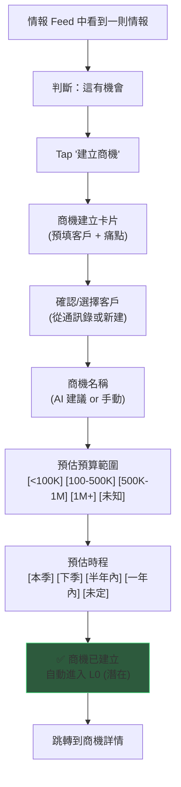

### 5B: 商機 Pipeline 列表

兩種檢視模式，右上角切換按鈕：

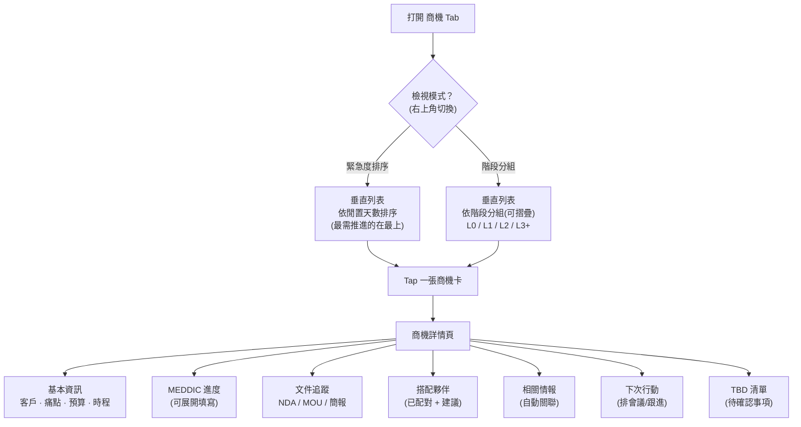

### 5C: 商機推進（狀態轉換）

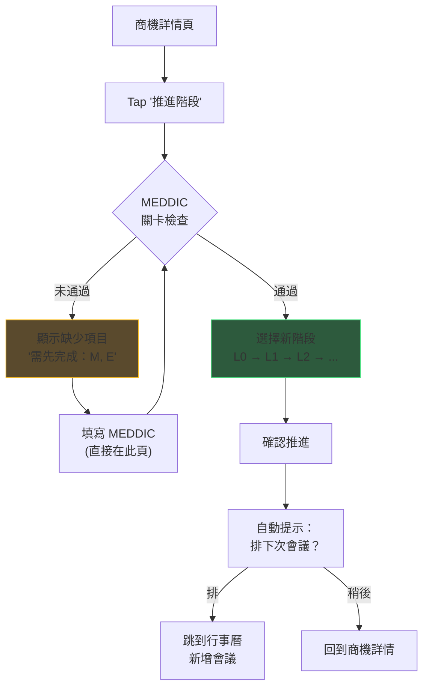

### 5D: 商機配對夥伴

```mermaid
flowchart TD
    A["商機詳情 → 夥伴區塊"] --> B{"已有配對夥伴？"}
    B -->|"有"| C["顯示已配對夥伴卡片\n能力 · 信任度 · 合作記錄"]
    B -->|"無"| D["系統建議\n(根據能力標籤 × 信任度)"]

    D --> E["顯示推薦夥伴\n排序 by 匹配度"]
    E --> F["Tap 選擇夥伴"]
    F --> G["加入此商機"]
    G --> C

    C --> H["手動搜尋\n+ 新增夥伴"]

    style D fill:#2d4a5a,stroke:#60a5fa
```

---

## Flow 6: 行事曆 (Calendar)

### 6A: 行事曆主視圖

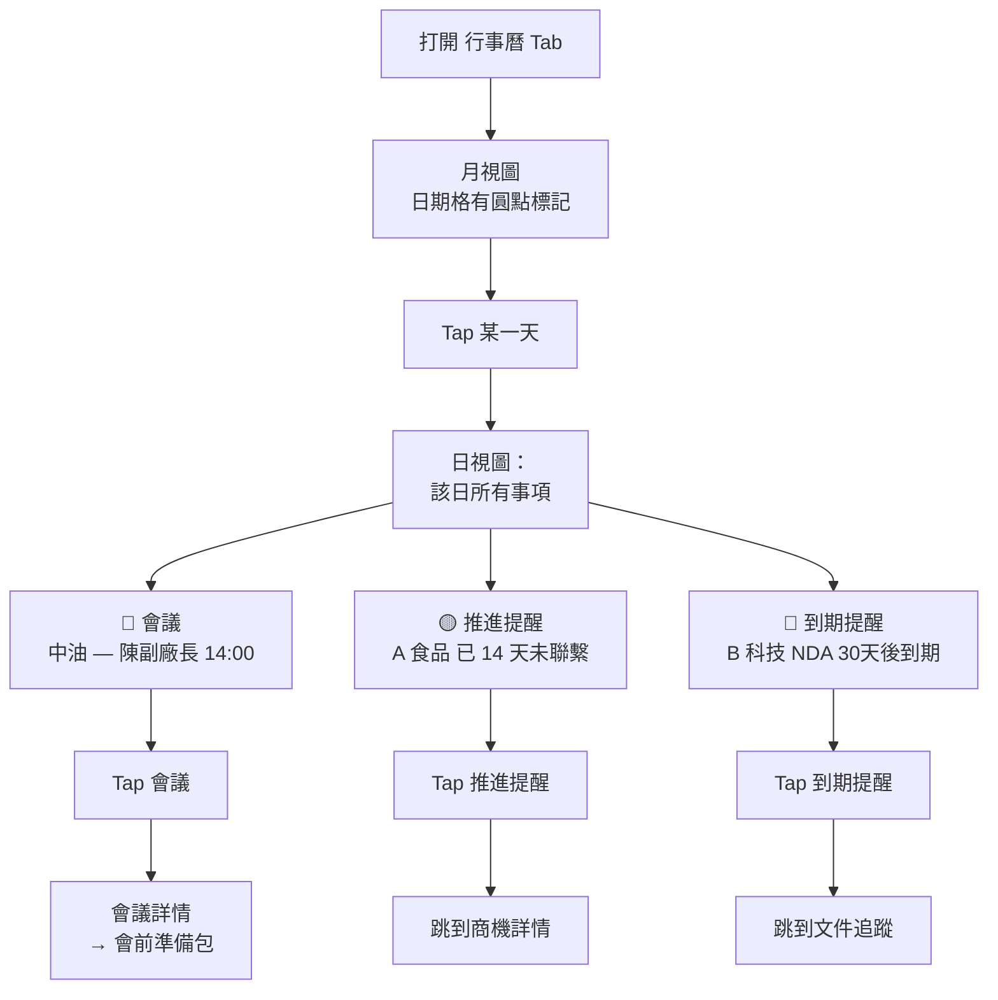

### 6B: 新增會議（從行事曆）

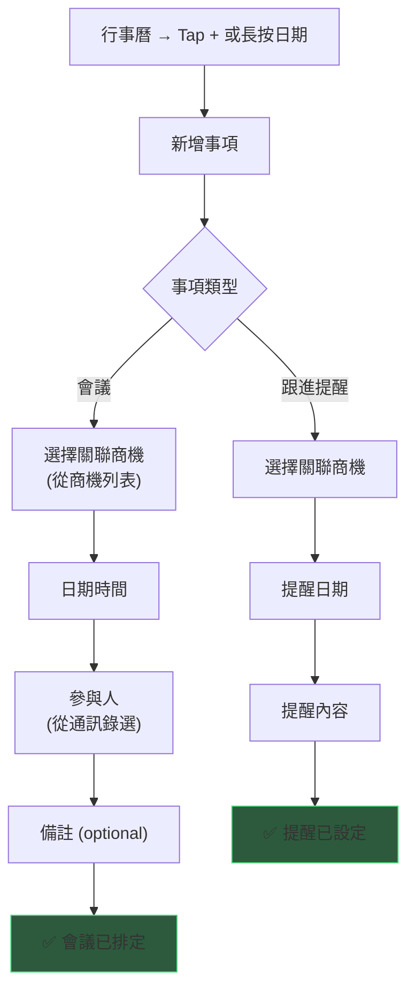

### 6C: 會前 → 開會 → 會後 完整循環

```mermaid
flowchart TD
    A["行事曆顯示\n今天有會議"] --> B["Tap 會議卡片"]
    B --> C["會前準備包"]

    C --> C1["📋 TBD 清單\n上次待確認的 3 件事"]
    C --> C2["📊 MEDDIC 進度\n目前 3/6"]
    C --> C3["📄 NDA: 已簽 ✓\nMOU: 待簽 ⚠️"]
    C --> C4["💡 建議提問\n(AI 根據 TBD + MEDDIC 缺口)"]
    C --> C5["📝 歷史情報\n(過去 3 則相關紀錄)"]

    C1 --> D["帶著準備去開會"]
    C2 --> D
    C3 --> D
    C4 --> D
    C5 --> D

    D --> E["會後：Tap '記錄會議結果'"]
    E --> F["情報輸入\n(同 Flow 1 的文字輸入)"]
    F --> G["AI 解析"]
    G --> H["自動更新：\n解決的 TBD 打勾\n新 TBD 加入\nMEDDIC 進度更新"]

    H --> I["提示：排下次會議？"]
    I -->|"排"| J["新增下次會議\n→ 行事曆"]
    I -->|"稍後"| K["回到商機詳情"]

    style D fill:#3d3d5a,stroke:#a78bfa
    style H fill:#2d5a3d,stroke:#4ade80
```

---

## Flow 7: 自動提醒系統

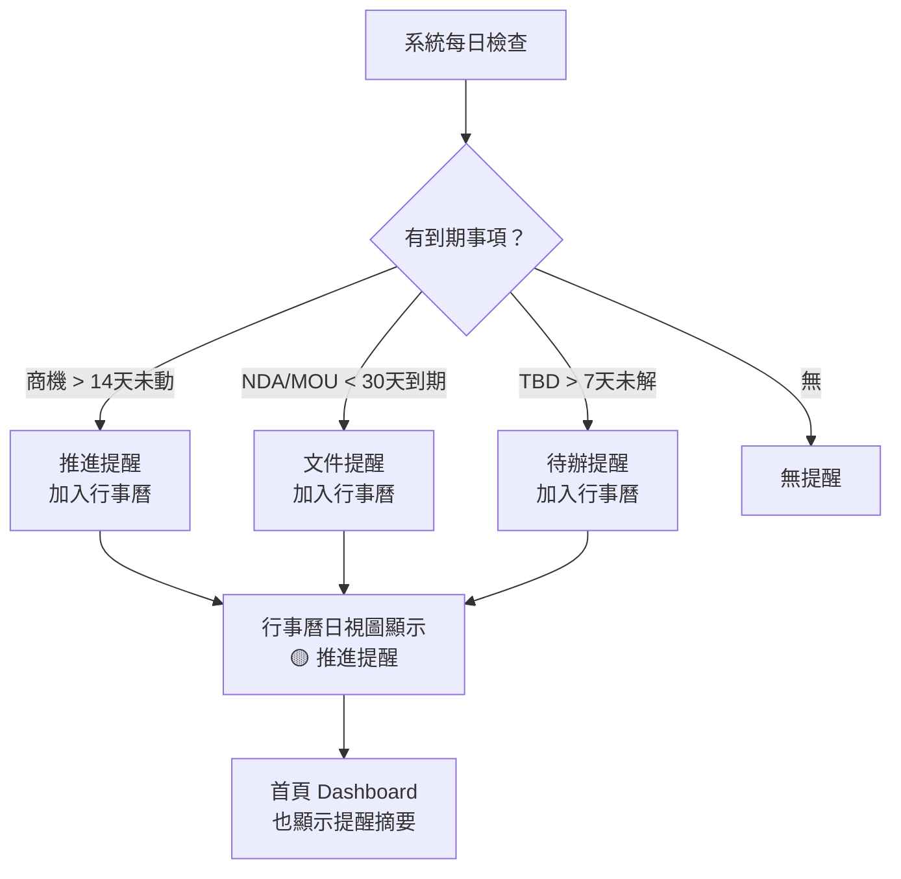

---

## Flow 8: 文件上傳 + AI 解析

### 8A: 上傳文件（從商機詳情）

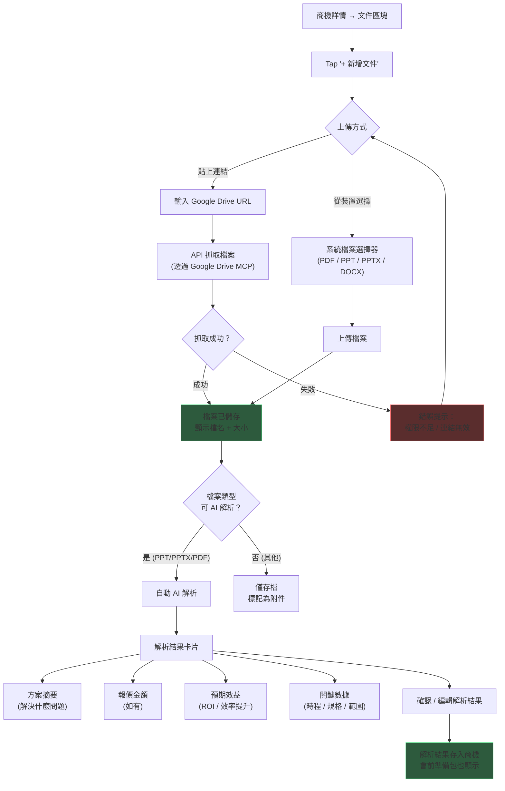

### 8B: 文件類型與標籤

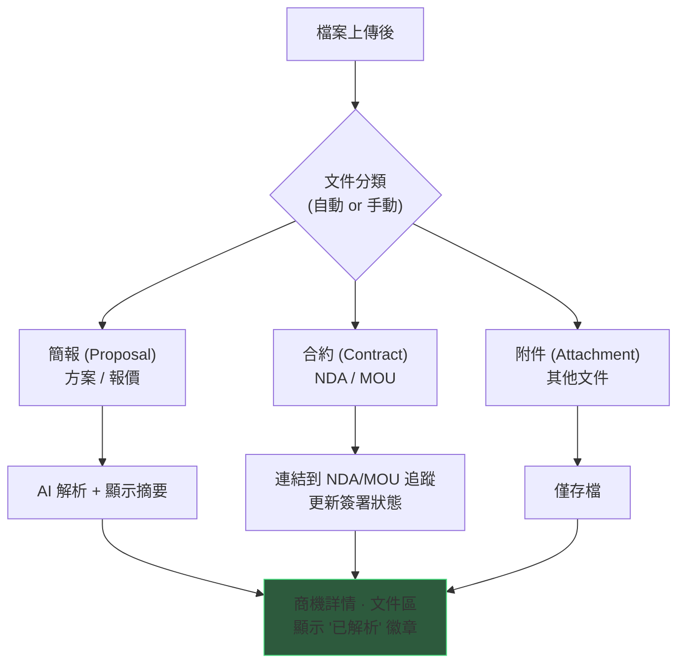

---

## Flow 9: 搜尋與篩選

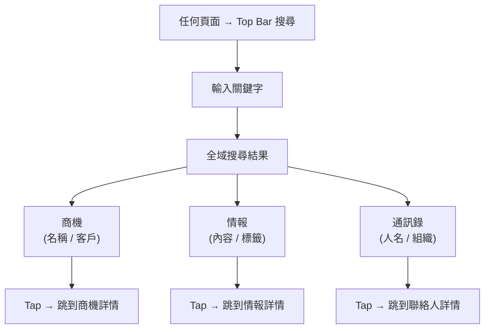

---

## Flow 10: 商機關閉（唯一路徑）

```mermaid
flowchart TD
    A["商機詳情頁"] --> B["Tap '關閉商機'"]
    B --> C{"確認原因"}

    C -->|"客戶明確拒絕"| D["選擇拒絕原因\n[預算不足] [時程不合]\n[選擇競品] [需求消失] [其他]"]
    C -->|"取消"| E["返回商機詳情"]

    D --> F["備註 (optional)"]
    F --> G["二次確認：\n確定關閉？"]
    G -->|"確定"| H["商機狀態 → 已關閉\n記錄關閉日期 + 原因"]
    G -->|"取消"| E

    H --> I["回到 Pipeline 列表\n(已關閉商機灰顯)"]

    style H fill:#3d3d3d,stroke:#9ca3af
```

---

## Flow 11: 情報關聯商機

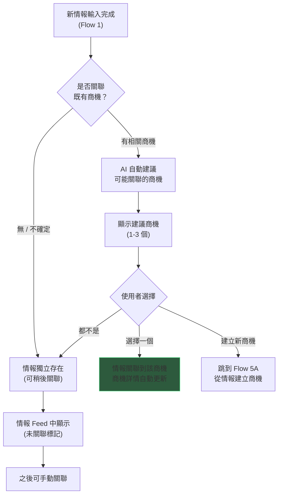

---

## Updated Screen Inventory

| # | Screen | Tab | Purpose |
|---|--------|-----|---------|
| 1 | **商機 Pipeline** | 商機 | 垂直列表，可切換：緊急度排序 / 階段分組 |
| 2 | **商機詳情** | 商機 | MEDDIC、文件(含簡報)、夥伴、TBD、情報、行動 |
| 3 | **建立商機** | 商機/情報 | 關聯客戶 + 命名 + 預算 + 時程 |
| 4 | **行事曆 — 月視圖** | 行事曆 | 月曆 + 日期標記 |
| 5 | **行事曆 — 日視圖** | 行事曆 | 當日會議 + 提醒列表 |
| 6 | **新增會議/提醒** | 行事曆 | 關聯商機 + 日期 + 參與人 |
| 7 | **會前準備包** | 行事曆 | TBD + MEDDIC + 文件 + 簡報摘要 + 建議 + 歷史 |
| 8 | **情報收件匣** | ＋ | 拍照 / 文字輸入 |
| 9 | **AI 解析結果** | ＋ | 解析卡片 + 確認 |
| 10 | **卡片問答** | ＋ | 一次一題 Q&A |
| 11 | **情報 Feed** | 情報 | 所有情報 + 篩選 + 待補充 + 關聯狀態 |
| 12 | **通訊錄 — 客戶** | 通訊錄 | 客戶列表 + 篩選 |
| 13 | **通訊錄 — 夥伴** | 通訊錄 | 夥伴列表 + 能力篩選 |
| 14 | **聯絡人詳情** | 通訊錄 | 人物/組織 profile |
| 15 | **文件上傳** | 商機 | Google Drive 連結 / 裝置檔案 + AI 解析 |
| 16 | **搜尋結果** | 全域 | 跨商機/情報/通訊錄的搜尋 |
