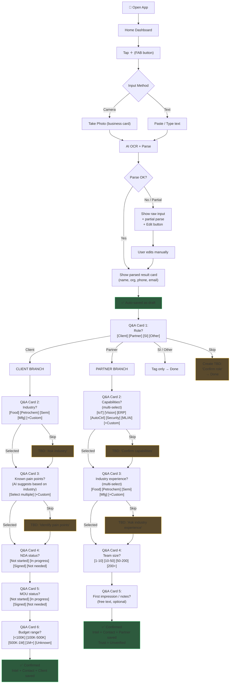

# User Flow: Engine 1 — Intel Inbox & Push Cycle

> **Date**: 2026-03-08
> **Requirement**: `docs/requirements/engine1-intel-inbox.md`

---

## Flow 1: Intel Capture (情報收件)

The primary daily action — dump intel, system structures it.

---

## Flow 2: Two-Week Push Cycle (推進循環)

The recurring rhythm — system drives, user executes.

```mermaid
flowchart TD
    A["📱 Open App"] --> B["Home Dashboard"]

    B --> C{"Any cases\n> 14 days idle?"}
    C -->|"Yes"| D["🔴 'Needs Pushing' section\nCases sorted by idle days"]
    C -->|"No"| E["🟢 All on track"]

    D --> F["Tap a case card"]
    F --> G["Pre-Meeting Prep Pack"]

    G --> G1["📋 TBD Items\n(from skipped Q&A +\nprevious meetings)"]
    G --> G2["📊 MEDDIC Progress\n3/6 completed"]
    G --> G3["📄 NDA/MOU Status\nNDA: Signed ✓\nMOU: Pending ⚠️"]
    G --> G4["💡 Suggested Questions\n(auto-generated from TBDs\n+ MEDDIC gaps)"]
    G --> G5["📝 Intel History\n(all past notes for\nthis client)"]

    G1 --> H["User reviews prep"]
    G2 --> H
    G3 --> H
    G4 --> H
    G5 --> H

    H --> I["Go to meeting"]
    I --> J["Post-meeting:\nTap ＋ → enter new intel"]
    J --> K["AI parses meeting notes"]

    K --> L{"TBDs resolved?"}
    L -->|"Yes"| M["Mark TBDs complete"]
    L -->|"Partial"| N["Keep open TBDs\n+ add new ones"]
    L -->|"No"| O["All TBDs carry forward"]

    M --> P{"Client says\nnot interested?"}
    N --> P
    O --> P

    P -->|"Yes"| R["Close case ⚫\n(only way to close)"]
    P -->|"No"| S["Case stays active\n→ Next 2-week cycle"]
    S --> B

    style D fill:#5a2d2d,stroke:#f87171
    style E fill:#2d5a3d,stroke:#4ade80
    style R fill:#3d3d3d,stroke:#9ca3af
    style S fill:#2d4a5a,stroke:#60a5fa
```

---

## Flow 3: Partner Trust Progression (夥伴信任升級)

```mermaid
flowchart LR
    A["Unverified\n(剛認識)"] -->|"Assign small\ntest project"| B["Testing\n(小案驗證中)"]
    B -->|"Delivered well"| C["Verified\n(已驗證)"]
    B -->|"Failed / unreliable"| D["Demoted\n(不推薦)"]
    C -->|"Multiple successful\ncollaborations"| E["Core Team\n(核心班底)"]

    A -->|"Bind under\nlarge SI"| F["SI-Backed\n(SI 擔保)"]
    F -->|"Direct collaboration\nproven"| C

    style A fill:#5a4a2d,stroke:#fbbf24
    style B fill:#2d4a5a,stroke:#60a5fa
    style C fill:#2d5a3d,stroke:#4ade80
    style D fill:#5a2d2d,stroke:#f87171
    style E fill:#1a4a1a,stroke:#22c55e
    style F fill:#3d3d5a,stroke:#a78bfa
```

---

## Flow 4: NDA/MOU Lifecycle (文件追蹤)

```mermaid
flowchart TD
    A["New Client Created"] --> B["Auto-create:\nNDA = Pending\nMOU = Pending"]

    B --> C{"Client says\nnot needed?"}
    C -->|"Yes"| D["Mark: Not Required"]
    C -->|"No"| E["Status: Pending"]

    E --> F["User uploads\nsigned doc"]
    F --> G["Status: Signed\nRecord sign date\n+ expiry date"]

    G --> H{"Expiry within\n30 days?"}
    H -->|"Yes"| I["⚠️ Warning on\ndashboard + prep pack"]
    H -->|"No"| J["✅ Valid"]

    I --> K["User renews\nor extends"]
    K --> G

    style D fill:#3d3d3d,stroke:#9ca3af
    style G fill:#2d5a3d,stroke:#4ade80
    style I fill:#5a4a2d,stroke:#fbbf24
```

---

## Screen Inventory

| # | Screen | Purpose | Key Elements |
|---|--------|---------|-------------|
| 1 | **Home Dashboard** | Daily command center | Needs-pushing cards, recent intel feed, needs-input section, FAB (+) button |
| 2 | **Intel Capture** | Input raw intel | Camera button, text area, submit |
| 3 | **Parse Result** | Show AI-parsed output | Parsed card (editable), edit button, auto-save indicator |
| 4 | **Q&A Cards** | Step-by-step enrichment | One question per screen, tappable options, skip button, progress dots |
| 5 | **Client Detail** | Client profile & history | Industry, pain points, NDA/MOU status, intel history, TBD list, MEDDIC |
| 6 | **Partner Detail** | Partner profile & trust | Capabilities, trust level, strengths/weaknesses, collaboration history |
| 7 | **Pre-Meeting Prep** | Consolidated meeting prep | TBDs, MEDDIC progress, NDA/MOU, suggested questions, intel history |
| 8 | **Client List** | Browse/search clients | Filter by industry, tag, idle days; sort by urgency |
| 9 | **Partner List** | Browse/search partners | Filter by capability, trust level, industry |
| 10 | **Intel Feed** | Chronological intel history | All intel entries, filterable by client/partner/tag |
| 11 | **TBD List** | All open action items | Grouped by client/partner, sortable by age |
| 12 | **Document Tracker** | NDA/MOU overview | Status badges, expiry warnings, upload buttons |
