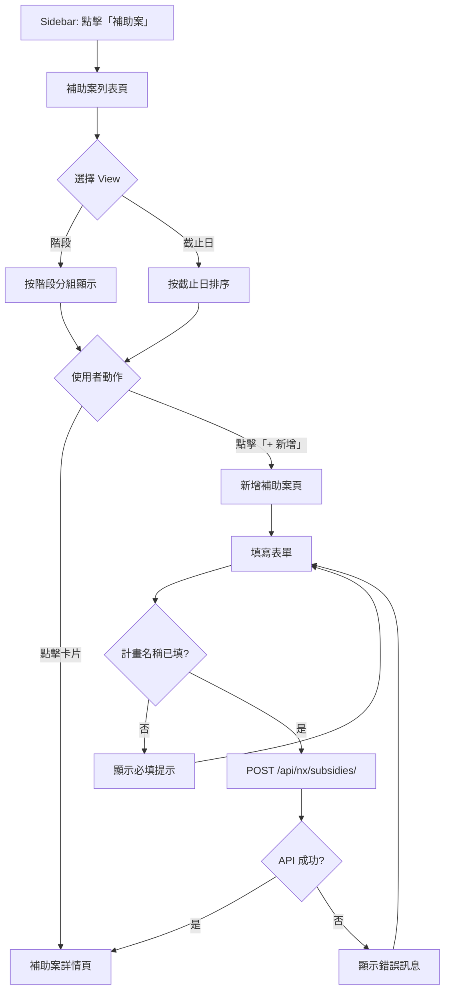
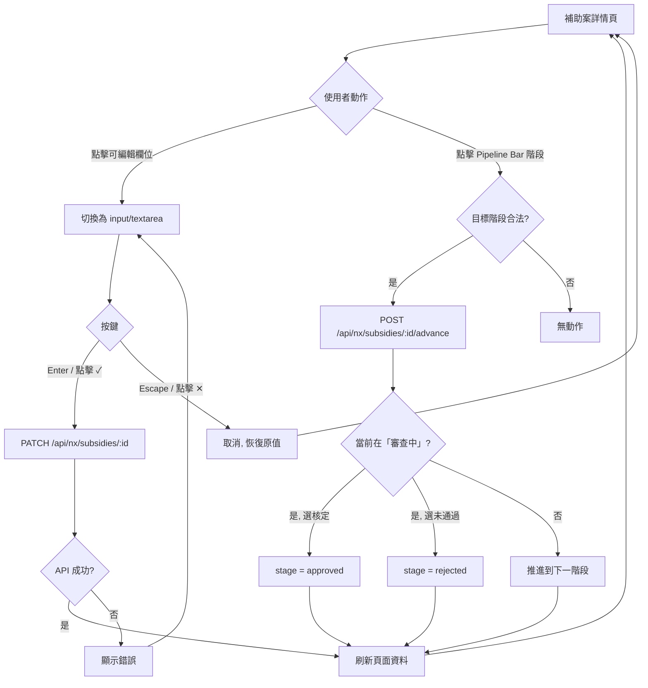
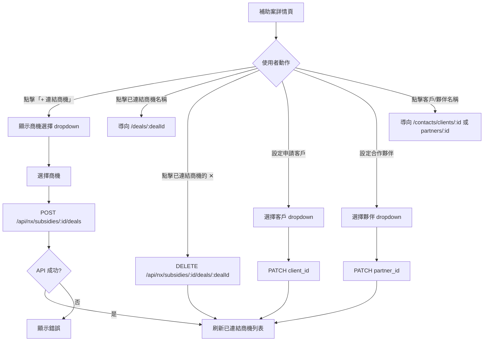
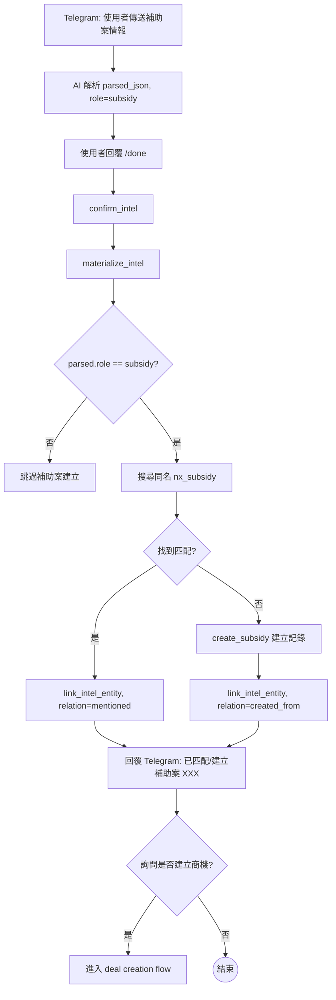
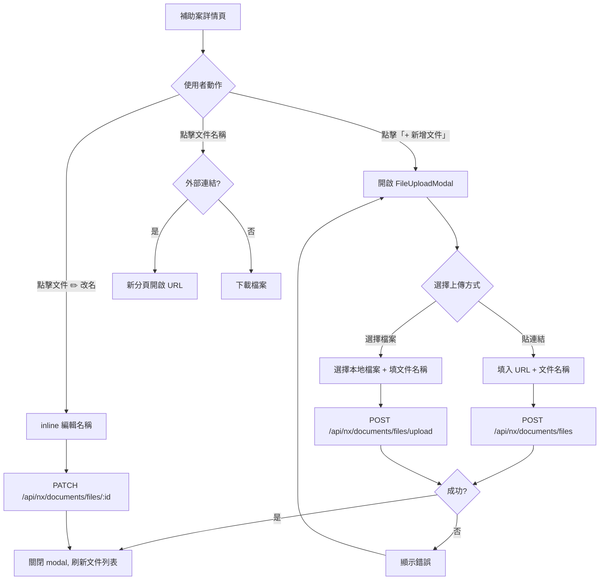
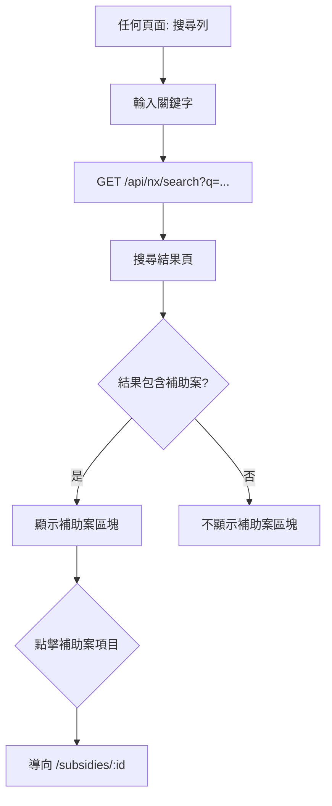

# User Flow: 補助案模組

## Flow 1: 瀏覽 + 建立補助案 (US-1, US-2)

## Flow 2: 編輯 + 階段管理 (US-3, US-4)

## Flow 3: 連結商機 + 客戶 + 夥伴 (US-5, US-6)

## Flow 4: Telegram 情報自動建立 (US-7)

## Flow 5: 文件管理 (US-8)

## Flow 6: 全域搜尋 (US-9)

## Screen Inventory

| # | Screen | Route | Purpose | Key Elements |
|---|--------|-------|---------|-------------|
| 1 | 補助案列表 | `/subsidies` | 瀏覽所有補助案 | View 切換 (stage/deadline), SubsidyCard, + 新增按鈕, 到期警示 |
| 2 | 新增補助案 | `/subsidies/new` | 建立新補助案 | 表單: name(必填), agency, program_type, deadline, funding_amount, eligibility, scope, required_docs, reference_url, client selector, partner selector |
| 3 | 補助案詳情 | `/subsidies/[id]` | 查看/編輯補助案 | Pipeline bar, inline edit fields, linked deals, linked client/partner, files, related intel |
| 4 | 商機詳情 (修改) | `/deals/[id]` | 顯示關聯補助案 | 新增「補助案」區塊在右欄 |
| 5 | 客戶詳情 (修改) | `/contacts/clients/[id]` | 顯示關聯補助案 | 新增「相關補助案」區塊在右欄 |
| 6 | 搜尋結果 (修改) | `/search` or inline | 包含補助案結果 | 新增 subsidies 結果區塊 |

### Reusable Components

| Component | Reuse From | Used In |
|-----------|-----------|---------|
| TopBar | existing | 列表, 詳情, 新增 |
| FileUploadModal | existing | 詳情頁 |
| Inline edit (editField/editValue) | deals/[id] pattern | 詳情頁 |
| Pipeline bar | deals/[id] stage bar | 詳情頁 |
| SubsidyCard | new (similar to DealCard) | 列表頁 |
